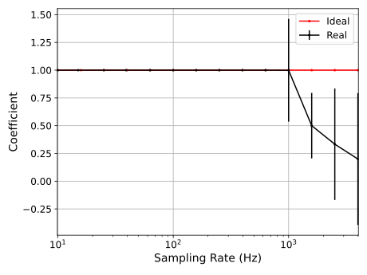
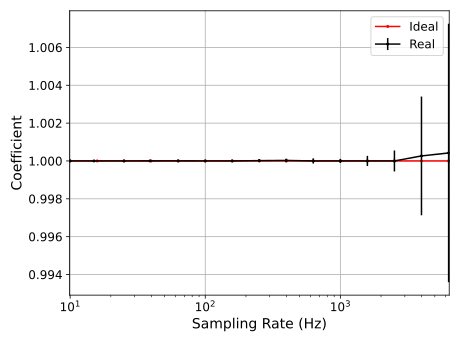

# Python API for interfacing custom DAQ hardware

## Installation Guide
For using this framework, the following software tools are necessary / recommended.
- `uv` package manager ([Link](https://docs.astral.sh/uv/), [Using](https://www.saaspegasus.com/guides/uv-deep-dive/))
- git ([Link](https://git-scm.com/downloads))
- PyCharm Community Version ([Link](https://www.jetbrains.com/de-de/pycharm/download/#section=windows))

We recommended to install all python packages for using this API with a virtual environment (venv). Therefore, we also recommend to `uv` package manager. `uv` is not a standard package installed on your OS. For this, you have to install it in your Terminal (Powershell on Windows) with the following line.
```
powershell -c "irm https://astral.sh/uv/install.ps1 | iex"
```
Afterwards you can create the venv and installing all packages using this line.
```
uv sync (--refresh --upgrade)
```
In the last step, you activate the Python Environment of your venv.

If you create a new repo and you want to use the functionalities of this Python tool. Then please initialise the project.toml using `uv` and write the following code into the terminal.
```
uv add "git+https://github.com/AErbsloeh/rp2_runtime_example.git"
```
## Contributing
It is recommended that each new feature will be edited in a new branch. If the integration is done and all tests are run successfully, please create a pull request for merging it back into the main branch. 

## Benchmarks
After flashing the hardware with the template firmware, you can run a benchmark to define when the applied sampling rate will break the end-to-end data transfer. 
<p>


</p>
In this example, a sweep is done from 10 Hz to 7 kHz for sample data transmission (left) and batch data transmission (right). The coefficient is defined as ratio of the measured sampling rate from the timestamps vs. applied sampling rate. Ideally, it is one with less variation.
As expected, in sample mod, the data transmission is broken down when the sampling rate is above 1 kHz. The batch mod is not affected by this.

You can find the benchmark script in the `scripts` folder.